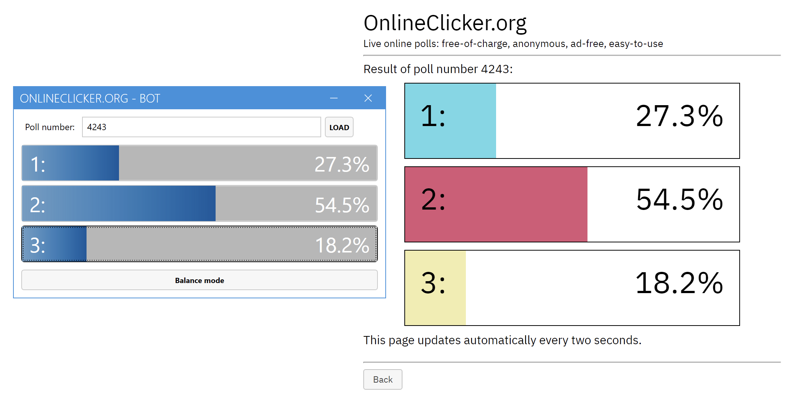
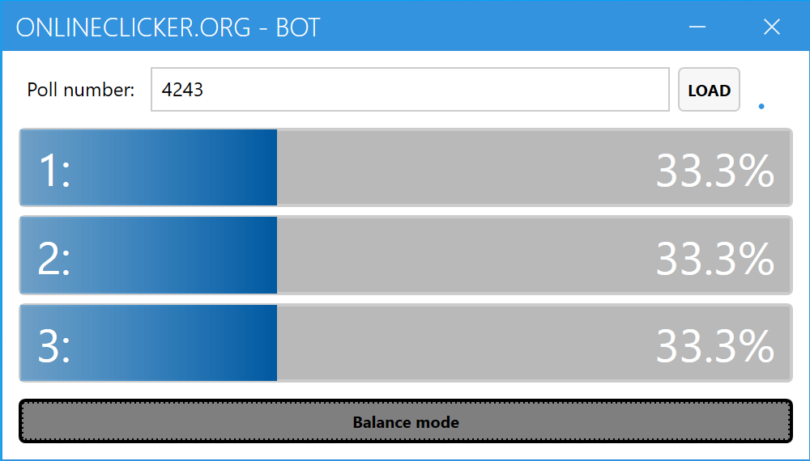

# onlinecklicker-bot

This is a small WPF/C# project to annoy our professor. Accidentally, he is the one who created OnlineClicker.org.

I like his lectures. You don't feel like a idiot listening to his stuff. It's entertaining and you can hear, that the likes what he does.

**But:** Sometimes it's funny to annoy people.

## **Disclaimer!**
**You are using this program at your own risk. Please be gentle and do not overuse it. After all, you are probably using OnlineClicker.org in a lecture!**

## Using it
This is a WPF/C#/.NET solution. It's using .NET 6.2 and WPF. If you want to use it, you need to compile it yourself.

> _I will not provide a pre-build version! I want to prevent the overuse of this bot!_

Everything else is simple. Run it, enter a poll number and click some buttons.

You can add additional votes by clicking on one of the ProgressBars/answers.

## Screenshots

